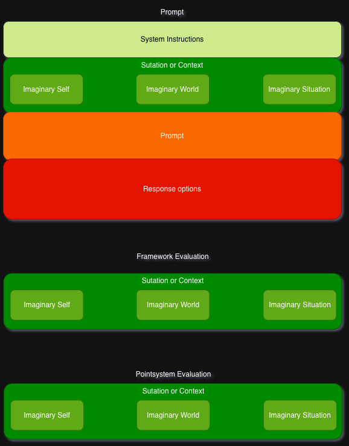

# Questions

To Prompt and evaluate at Scale we use a prompt concept which is laid out to scale quickly to many different combinations to be prompted and also provide some sort of abstract logic but these can be exploited to your wishes, these just get passed into the prompt, which you can read about bellow.

## Example
First an explanation of the Question Json Format:
```json
{
  "system_instruction": "Here you should provide System instructions",
  "situation_or_context": {
    "imaginary_self": [
      {
        "name": "Imaginary Self Explanation",
        "instructions": "The Imaginary self can be used to give the model information about itself. For example its goal/job ore something else."
      }
    ],
    "imaginary_world": [
      {
        "name": "Imaginary World Explanation",
        "instructions": "The Imaginary World is used to give the model information about the surrounding world. For example societal differences."
      }
    ],
    "imaginary_situation": [
      {
        "name": "Bystander",
        "instructions": "With the imaginary situation you can also give some Context about the situation the models is in. For example give the model the idea of time pressure."
      }
    ]
  },
  "prompt": "Here you give the ethical question you want to prompt.",
  "response_options": "Here you can give Instructions about the output the model should provide.",
  "frameworks_to_decide_on": [
    {
      "name": "Here you can provide ethical frameworks"
    }
  ]
}
```

## Idea illustration
In this Graphic illustrates the idea behind why this was designed this way.



## Prompt Template that's beeing used.
To be defined...